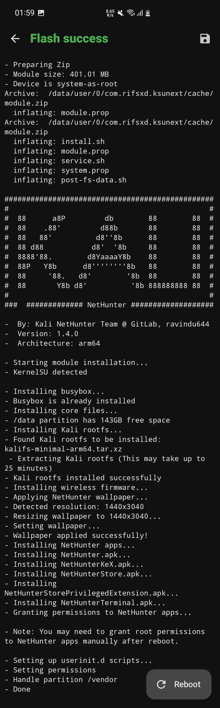

# Kali NetHunter Unified Installer

A modern, lightweight, and unified installer for Kali NetHunter that works seamlessly across APatch, KernelSU, and Magisk.

<details>
<summary>Click to see installation screenshot</summary>



</details>

## Why This Exists

The official Kali NetHunter installer is bloated with legacy code supporting outdated installation methods like TWRP/Recovery and does not work with KernelSU/APatch. This project was created to:

- Eliminate bloat and outdated methods from the official installer
- Create a unified installer that works across all major root solutions (APatch, KernelSU, Magisk)
- Provide a cleaner, faster, and more maintainable codebase
- Free NetHunter users from being locked into a single root solution

This installer is focused solely on modern root managers and does not support custom recovery installations.

## Key Improvements Over Official Installer

- 50% smaller codebase (~500 lines vs ~1000 lines)
- Automatic screen resolution detection and wallpaper resizing (a working implementation, unlike the broken official method)
- Tablet detection to prevent wallpaper stretching
- Preserves existing Kali chroot installations (no data loss on updates)
- Safe system integration (doesn't replace Toybox binaries with Busybox applets)
- Dynamic storage requirements (4GB for minimal, 10GB for full)
- Unified across APatch, KernelSU, and Magisk

## Features

- Automatic architecture detection to use core binaries from the ZIP file (arm64/armhf)
- BusyBox installation and integration
- Kali rootfs extraction and setup
- Wireless firmware installation
- NetHunter app installation with automatic permission granting
- Dynamic wallpaper resizing using ImageMagick
- Proper SELinux context handling
- Conflict resolution with other modules

## Installation

### Step 1: Download

Download the appropriate zip file from the [GitHub Releases](../../releases) page:

- **Minimal build**: Single zip file, ready to flash
- **Full build**: Due to GitHub's 2GB limit, the full build is split into multiple parts

#### For Full Build (Split Files)

1. Download all split files with the same base name:
   - `kali-nethunter-*-full-unified-split.zip`
   - `kali-nethunter-*-full-unified-split.z01`

2. Place all files in the same folder

3. Extract using any zip tool that supports split archives:
   - **Linux**: `7z x kali-nethunter-*-full-unified-split.zip`
   - **Windows**: Use 7-Zip or WinRAR to extract

4. You will get a single unified zip file (approximately 2.7GB)

### Step 2: Flash the Module

1. Open your root manager (APatch/KernelSU/Magisk)
2. Navigate to the Modules section
3. Select "Install from storage"
4. Choose the unified NetHunter zip
5. Wait for installation to complete

> [!NOTE]
>
> **You may need to disable Google Play Protect** because it falsely detects NetHunter as malware and prevents the `pm` utility from installing the apps during installation.
>

### Step 3: Reboot

Reboot your device to activate the module.

### Step 4: Configure

1. Enable "Global mount namespace" option in your root manager settings (optional but recommended)
2. Grant root permissions to NetHunter apps when prompted

### Step 5: Done

Launch the NetHunter app and start using Kali Linux on your Android device.

## Build Your Own

You can create custom NetHunter zips by forking this repository and using GitHub Actions.

### Manual Build

Requirements:
- `curl`
- `unzip`
- `rsync`
- `zip`

Usage:
```bash
./magisk-2-ksu.sh <nethunter-generic-zip-url-or-path>
```

Example:
```bash
# From URL
./magisk-2-ksu.sh https://kali.download/nethunter-images/kali-2025.4/kali-nethunter-2025.4-generic-arm64-full.zip

# From local file
./magisk-2-ksu.sh /path/to/kali-nethunter-2025.4-generic-arm64-full.zip
```

The script will:
1. Download/copy the official NetHunter generic zip
2. Extract the rootfs and APKs
3. Combine with the unified installer
4. Package everything into a flashable zip

### Automated Build (GitHub Actions)

1. Fork this repository
2. Go to Actions tab
3. Select "Build and Release Unified NetHunter Modules"
4. Click "Run workflow"
5. Provide URLs for minimal and full builds
6. Wait for the workflow to complete
7. Download from the generated release

Full freedom to customize and build your own.

## Project Structure

```
kernelsu-module/
├── install.sh                  # KernelSU/APatch/Magisk entry point
├── module.prop                 # Module metadata
├── META-INF/
│   └── com/google/android/
│       ├── update-binary       # Core setup and module.prop parser
│       ├── updater-script      # Compatibility placeholder
│       └── util-functions.sh   # All installation functions
├── common/
│   ├── post-fs-data.sh        # Post-fs-data hook
│   ├── service.sh             # Late_start service hook
│   └── system.prop            # System properties
├── busybox/                   # BusyBox binaries (arm/arm64)
├── wallpaper/                 # NetHunter wallpaper + ImageMagick
├── system/                    # System overlay files
└── APKs/                      # NetHunter APKs

magisk-2-ksu.sh                # Converter script (official → unified)
```

## Compatibility

- APatch (all versions)
- KernelSU (all versions)
- Magisk (v20.4+)

Tested on:
- Android 12-16 with KernelSU and SuSFS

## Requirements

- At least 4GB free space on /data (minimal build)
- At least 10GB free space on /data (full build)
- Rooted device with APatch, KernelSU, or Magisk installed

## Credits

- Official Kali NetHunter Team for the original implementation
- [Brutal Busybox](https://github.com/feravolt/Brutal_busybox)
- [Android-ImageMagick7](https://github.com/MolotovCherry/Android-ImageMagick7)
